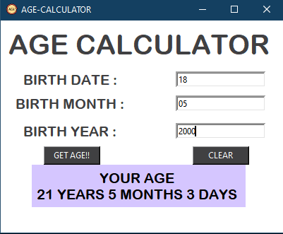
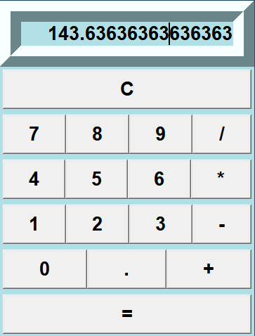
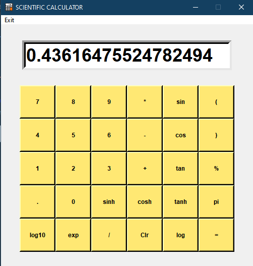

# Age Calculator 

### Calculate your current age with this simple AgeCalculaor program written in python.

## Output:

 

# General Calculator

### Simple application to perform basic Arithmetic Calculations.

## Output:

 

# Scientific Calculator

### Application to perform calculations, ranging from basic arithmetic to complex mathematics.

## Output:

 
